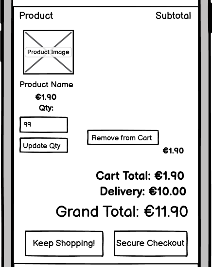
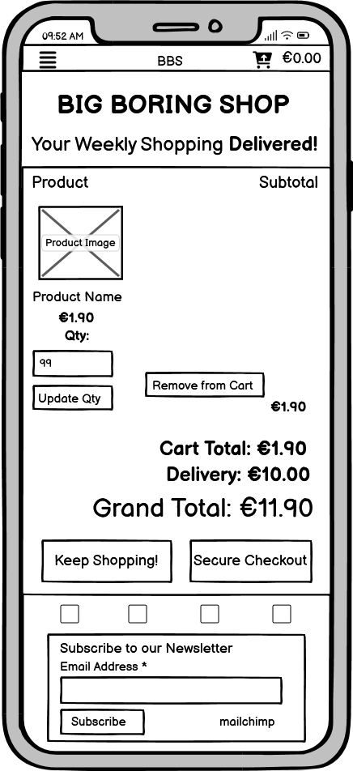
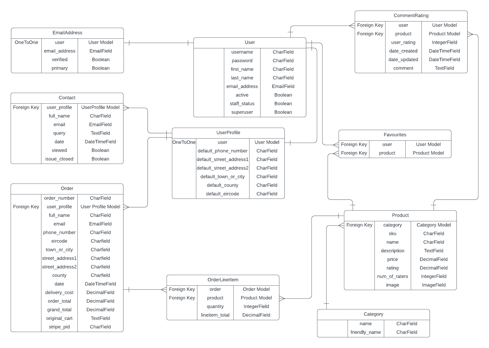
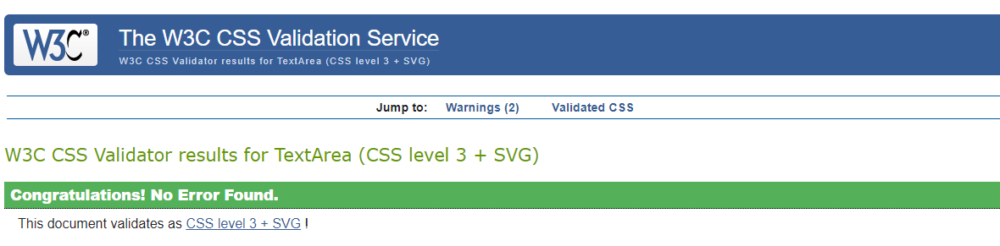
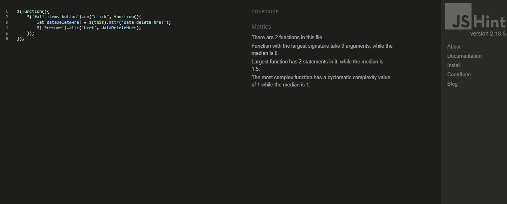
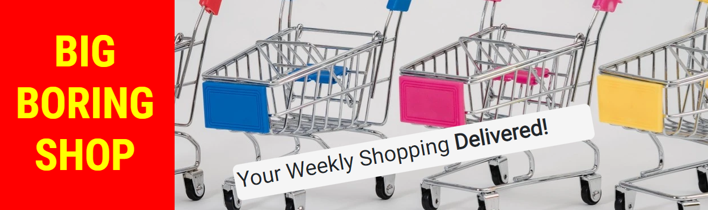

# Portfolio Project 5 - Big Boring Shop README

## 1. Purpose of the Project

Big Boring Shop intends to establish itself as an online grocery store. Its stated aim is to compete with low-cost grocery retailers but in the form of a fully online service including delivery with no high street presence. The lack of a high street presence is a deliberate part of the business model, with the aim of eliminating the high costs associated with this form of retail. Instead a warehouse and delivery system will form the key business infrastructure.

Furthermore, with a view to providing a competive service the store will focus on a narrow selection of popular, high volume, day to day household goods and foods. Niche products will not form part of the offering.

In terms of the marketing of the business the intention is to be quite upfront about the model. The business will be saying to customers that the big weekly shop to buy the usual essentials is also the big, time consuming, not so exciting weekly chore - the Big Boring Shop! So why not spend your precious time doing something a bit more exciting, maybe some proper retail therapy, and let us look after the boring stuff! We will even deliver to your door.

As the model relies entirely on an online presence, the need for a simple easy to use website and payment system together with a comprehensive web marketing strategy is clear.

## 2. E-commerce Model

The proposed e-commerce application type can be defined as follows:

* It is a business-to-customer(B2C) model selling ito individual grocery customers and households.

* It is selling groceries and is therefore a "products" application type.

* It will accept single "one-off" payments.

Based on the above key features that will need to be provided are as follows:

* An easy payment gateway including a shopping cart, purchase summary and a secure, recognised, easy to use debit/credit card payment system.

* Clear product descriptions together with high quality images.

* Product search and filter options.

* Order notifications.

* Product Ratings/ Reviews.

* Ability to create a user account with appropriate authentication.

As a result the following database tables will be required:

* User
* Email Address
* User Profile
* Products
* Category
* Order
* Order Item
* Comment/Rating
* Contact
* Favourites

The above outlines the key elements of the proposed e-commerce model and the remainder of this document is developed with this model in mind.

## 3. User Stories - Minimum Viable Product (MVP)

1. As a **Visiting User** I can **easily view information on the type of business this is** so that **I can quickly determine if the business provides the service/products I require.**

2. As a **Visiting User** I can **view a list of products the business sells** so that **I can choose items I may wish to purchase.**

3. As a **Visiting User** I can **search and filter the products list** so that **I can easily find the products I need.**

4. As a **Visiting User** I can **view the details for a specific product** so that **I can decide if the particular product is the one I wish/need to purchase.**

5. As a **Visiting User** I can **view details, including costs, for delivery** so that **I know what the costs and terms are before I start spending time adding items to a potential purchase list.**

6. As a **Visiting User** I can **add items to a shopping cart** so that **after choosing an item to potentially purchase I can continue to look at other items, add further items, and keep track of the overall potential total.**

7. As a **Visiting User** I can **view my shopping cart purchase summary** so that **I can review all of the items I have added to the cart and the total purchase cost.**

8. As a **Visiting User** I can **adjust the quantity of any item in my cart or remove an item completely** so that **I can easily confirm a final purchase list just prior to making a purchase.**

9. As a **Visiting User** I can **make an online payment with my debit or credit card** so that **I can easily purchase my chosen products.**

10. As a **Visiting User** I can **create an account and save my details** so that **I do not have to enter all of my details each time I make a purchase on this website.**

11. As a **Site Administrator** I can **log in to the admin pages of the website** so that **I can securely carry out admin functions in sections of the site not accessible to the general public.**

12. As a **Site Administrator** I can **add products to the product list** so that **the website can be easily updated with the latest product offerings from the business.**

13. As a **Site Administrator** I can **edit product details** so that **the product details can be easily kept up to date over time.**

14. As a **Site Administrator** I can **delete products from the product list** so that **any products no longer sold by the business are easily removed from the product offering.**

15.  As a **Visiting User** I can **navigate to a contact page** so that **I can view the various ways to contact the business including by means of a contact form.**

16. As a **Visiting User** I can **complete a contact form and provide my name, email and comment or query** so that **I can easily contact the business and expect a reply.**

17. As a **Registered User**  I can **add products to a favourites list as I shop** so that **I can easily find the products I buy most often on future visits.**

18. As a **Registered User** I can **view my favourites list** so that **I can easily add any of these items to my cart when shopping.**

19. As a **Registered User** I can **delete items from my favourites list** so that **I can keep my list up to date with my current preferences.**

20. As a **Registered User** I can **rate products** so that **I can assist my fellow customers and benefit when they do likewise.**

21. As a **Registered User** I can **see rating I gave on products I have rated** so that **I know if I have previously rated a product and what rating I gave it.**

22. As a **Registered User** I can **edit the rating I gave to products** so that **I can easily change my view of a product over time.**

23. As a **Registered User** I can **delete the rating I gave to a product** so that **I can easily remove my input regarding a particular product if I no longer have a view on it.**

24. As a **Registered User** I can **comment on products** so that **I can assist my fellow customers and benefit when they do likewise.**

25. As a **Registered User** I can **see comments I made on products** so that **I know if I have previously commented on a product and what comment I made**

26. As a **Registered User** I can **edit comments I made about products** so that **I can easily change my view of a product over time.**

27. As a **Registered User** I can **delete comments I made on a product** so that **I can easily remove my input regarding a particular product if I no longer have a view on it.**

28. As a **Visiting User** I can **see an icon for the website on page tabs** so that **I can easily navigate pages when I have multiple tabs open.**

29. As a **Visiting User** I can **opt to sign up to a digital newsletter from the business** so that **I can keep up to date with new products and latest offers.**

30. As a **business owner** I can **maintain website consistency through the provision of a custom 404 page** so that **even when an error occurs that leads to a 404 return, the customer does not feel as if they have exited the site and can easily return to the home page.**

## 4. Features

Please note that the features section contains relevant extracts from the project wireframes. The complete wireframes are included in section 7 of this document.

### 4.1 Navigation Bar

* The navigation bar provides a Home link to return to the home page from any other page. This link will be highlighted to indicate when a user is on the homepage.

* The navigation bar contains the BBS logo. The logo is also a link to the home page in line with likely user expectations.

* The navigation bar provides a Shopping link to bring users to the page listing all products available for sale. This link will be highlighted to indicate when a user is on the shopping page.

* The navigation bar provides a Contact Us link to bring users to the page listing contact details for the business and a contact form. This link will be highlighted to indicate when a user is on the Contact Us page.

* When no user is logged in the navigation bar Account dropdown provides links to Register or Log In.

* When a user is logged in the Account dropdown provides links to My Profile and Log Out in place of the Register or Log In options.

* An Admin dropdown with links to the Django Admin Panel and the Add Product pages is available when a superuser is logged in.

* A link to the shopping cart page is also provided in the form of a shopping cart logo together with the current grand total in the cart.

* In the mobile view the main navigation collapses to a toggle button with just the BSS logo and the cart remaining visible.

Fig. 4.1.1 Navigation Bar - Desktop

Fig. 4.1.2 Navigation Bar - Mobile

### 4.2 Header

* The header contains the business name "Big Boring Shop" as an h1 heading in a prominent location on the page.

* The header contains a h2 sub-heading "Your weekly shopping delivered!".

* The header contains a hero image in desktop view with a theme related to the purpose of the website.

Fig. 4.2.1 Header - Desktop

Fig. 4.2.2 Header - Mobile

### 4.3 Footer

* The footer contains links to social media - Facebook, Instagram, Twitter, YouTube.

* The footer contains the newsletter registration form linking to the mailchimp service.

Fig. 4.3.1 Footer - Desktop

Fig. 4.3.2 Footer - Mobile

### 4.4 Home Page Main Section

* The home page contains a banner with the phrases "Time is precious so don't waste it shopping for bleach!" and "Let us take care of the Boring Stuff while You do You!!"

* The home page contains an About Us section.

* The home page contains a section with information on delivery.

* The mobile view is essentially the same except that the About Us and Delivery sections are vertically stacked as opposed to being alongside one another in the desktop view.

Fig. 4.4.1 Home Page Main Section

### 4.5 Shopping/Products Page

* The shopping/products page contains a search bar and a product categories button allowing customers to easily filter the products list.

* A product summary is displayed on a product card. Both clicking on the image and the Product Details link will lead to the detail page for that product.

* The individual cards wil wrap according to screen width and so will display side by side in rows on larger screens and in a single column on the smallest screens.

Fig. 4.5.1 Shopping/Products Page

### 4.6 Product Detail Page

* An image of the product together with the product name, description, price, SKU, and product category are displayed.

* An input field is provided to select the required quantity of the product and an add-to-cart button available to add the selected quantity of the item to the shopping cart.

* A Back button allows the shopper to return to the main products page.

* If the user is logged in the option to add the item to favourites is provided or a heart symbol is displayed if the item is already on the logged in users favourites together with the option to delete it from the favourites list.

* If the user is an admin superuser the product management options to edit or delete a product are provided.

* If a user is not logged in the comments and ratings section will only display other users' comments and ratings if they exist and will not provide an option to leave a comment or rating.

* If the user is logged in a comment and rating form will appear to allow the user to comment on and rate the product. If they have already commented on the product, this comment will appear highlighted as the user's, together with options to edit and delete the comment/rating.

* When a user adds or edits a rating the overall product rating is updated accordingly.

Fig. 4.6.1 Product Detail Page - Desktop

Fig. 4.6.2 Product Detail Page - Mobile

### 4.7 Shopping Cart

* A summary of the shopping cart items is displayed.

* An option to adjust the quantity of any particular item is provided.

* An option to remove an item from the cart is provided.

* The total, delivery charge, and grand-total are displayed.

* A button to return to shopping is provided.

* A button to proceed to the checkout is provided.

Fig. 4.7.1 Shopping Cart - Desktop

Fig. 4.7.2 Shopping Cart - Mobile

### 4.8 Checkout Page

* A brief summary of the charges to be processed is provided.

* This page contains a form with fields for full name, email address, phone number, Street Address 1, Street Address 2, Town or City, County and Eircode (post-code).

* A checkbox is provided for logged-in users, allowing them the option to add or update the user's profile with the details provided.

* A payment card input field is provided. This is an element provided by Stripe.

* Buttons to "Adjust Cart" or "Complete Order" are provided.

### 4.9 Checkout Success Page

* A shopper is redirected to this page following submission of a payment.

* This page displays a success message that includes an order number.

* This page displays an order summary.

* This page contains a back to home button

### 4.10 Edit Comment/Rating Page

* This page is reached when a logged-in user opts to edit a comment/rating from the product detail page.

* This page displays the same form as provided to add a comment but pre-populated with the existing comment/rating.

* An update comment button is provided.

### 4.11 Contact Us Page

* This page contains contact details for the business.

* A contact form is also provided. The form contains fields for full name, email and Query.

* A submit button is provided. Upon submission the page refreshes with confirmation of the message sent displayed at the top of the page.

* When queries/comments are submitted in this way they can be viewed by the business in the admin panel. The admin panel also displays fields for viewed and closed to allow easy administration of queries/comments on the admin side.

### 4.12 My Profile Page

* This page is available to logged-in users only and contains 3 sections, Default Delivery Information, Order History, and Favourites.

* The Default Delivery Information is displayed as an editable form, pre-populated with any previously saved information and a button to submit updated information.

* The Order History section displays a list summary of all previous orders. The order number is a link to the details of that order.

* The Favourites section displays the user’s favourites list together with an option to delete any favourite from the list. **NB Note that deleting an item from the list here will refresh the profile page. The option to remove an item from favourites is also provided in the product detail page and appears to the user as a toggle between adding and deleting. This is achieved by passing the appropriate redirect URL to the delete favourite view.**

* Both the image and the product name of any item on the favourites list are links to the product detail page for the item.

Fig. 4.11.1 Profile Page - Desktop

Fig. 4.11.2 Profile Page - Mobile

### 4.13 Order History Page

* This page is reached by clicking on an order link from the order history section of the My Profile page.

* It uses the same template as the checkout success page.

* The information message at the top informs the user that they are viewing an historic order in this case.

### 4.14 Product Management – Add Product Page

* This page is only available to admin/superusers

* This page displays a form for adding a product with fields for category, SKU, name, description and price.

* A button to add an image is also available

* An Add Product button and a Cancel button are provided.

### 4.15 Product Management – Edit Product Page

* This page is reached via a link in the product detail page available to logged-in superusers.

* The form is the same as that provided for adding products but is pre-populated with the existing product information.

* Options to add an image or remove an image are provided.

* An Update Product button and a Cancel button are provided.

### 4.16 Sign In Form

* The page containing this form is reached by clicking on Sign In from the Account dropdown on the navigation bar.

* The form contains fields to enter a username or email address and user password.

* The form has a submit button to process the entered information.

### 4.17 Sign Up Form

* The page containing this form is reached by clicking on Register from the Account dropdown on the navigation bar.

* The form contains fields to enter and confirm an email address, a field to enter a unique username, and fields to enter and confirm a user password.

* The form has a submit button to process the entered information.

### 4.18 Password Reset Form

* The page containing this form is reached by clicking on the Forgot Password? link on the Sign In page.

* The form contains a field to enter an email address.

* The form has a "Reset my Password" submit button to process the entered information.

### 4.19 Sign Out Page

* This page is reached by clicking on Sign Out from the Account dropdown on the navigation bar when a user is logged in.

* The page has a Sign Out button and a Back button to return to the home page without logging out.

## 5. Future Features

The following future features could be added in time:

1. A stock control system including the ability for admin to review stock quantities and the automatic displaying of out-of-stock information to customers when it occurs.

2. A system for managing order fulfillment and delivery confirmation.

3. An enhanced chat style contact us feature rather than just a simple contact form as currently provided.

4. Give users the ability to log in using an existing social media account.

5. Create an admin approval flow for customer product comments.

6. Give users the ability to filter product comments by date, rating, view my comments etc.

## 6. Typography and Color Scheme

### 6.1 Typography

The overall theme of the website is to be simple, clear, and a little brash in line with the simple product offering the business wants to proudly promote and shout about.

The text styles chosen are Roboto and Roboto Condensed. These give a simple easy to read and business-like appearance.

Roboto Condensed with a font weight of 700 has been used for headings, input labels and product prices.

Roboto has been used for all other texts. Generally the font weight used is 400 with occasional use of a 700 font weight where bold text is required.

### 6.2 Color Scheme

As stated above the site aims to keep a simple appearance with a slightly brash approach to catch the eye and confidently put forward its product offering. Therefore the chosen colours either are, or are close to, primary colours. 

#ff0000 (red) has been used as the background for the business name and the name is displayed in #ffff00 (yellow).

#f5f5f5 is a close to white color and is used as the background color for the h2 heading in the header and as the text color for the catchphrase banner on the homepage.

#212529 is a close to black color and is used as the background color for the catchphrase banner on the homepage and as the default text color.

#000000 (black) is used as the border color for form input fields, for form select fields and for form text areas.

#32cf2d is a close to green color and is the hover color for form input fields, for form select fields and for form text areas.

#e4eef7 is a light grey color chosen to provide the footer with a degree of contrast from other page content across all pages.

#df1a1a is a bright red color used for the heart icon to indicate products on a user’s favourites list.

#17a2b8, the bootstrap 4.4 “info” color is the background color for the About Us section on the home page and for the product category filter button on the product page.

#f8f9fa, the bootstrap 4.4 “light” color is the background color for the Delivery section on the home page.

#28a745, the bootstrap 4.4 “success” color has been used for green buttons.

#6c757d, the bootstrap 4.4 “secondary” color is used for grey buttons.

## 7. Wireframes

### 7.1 Home Page on Desktop

### 7.2 Home Page on Mobile

### 7.3 Product Page on Desktop

### 7.4 Product Page on Mobile

### 7.5 Product Detail Page on Desktop

### 7.6 Product Detail Page on Mobile

### 7.7 Profile Page on Desktop

### 7.8 Profile Page on Mobile

### 7.9 Shopping Cart Page on Desktop

### 7.10 Shopping Cart Page on Mobile

## 8. Database Entity Relationship Diagram

## 9. Search Engine Optimisation (SEO)

A process of determining keywords for the purpose of Search Engine Optimisation was undertaken in steps as follows:

### 9.1 Step 1 - Topics
Key topics the business would wish to rank highly for and that customers would likely search for were determined and listed as follows:

* Weekly Shopping
* Grocery Shopping
* Shopping Delivery

### 9.2 Step 2 - Keyword Dump

Keywords were then listed under these topics:

* Weekly Shopping

Supermarket, Shopping ,Local, Online shopping, Best places to do my weekly shopping

* Grocery Shopping

Groceries, Grocery, Fresh Food, Cupboard, Freezer, Drinks, Health and Beauty, Household, Value for money, grocery shopping

* Shopping Delivery

Delivery, Deliver my groceries, Deliver my shopping, Local delivery from a local store, Best place to get my weekly shopping delivered from

### 9.3 Step 3 - Google Search

Using the above list of potential keywords google searches were undertaken to discover popular search terms via the search bar prompts and the “people also searched for” section of returned results. The following list of popular search terms was compiled:

* Best places to do weekly shopping in Ireland
* Which app is best for daily grocery shopping?
* How do I only go to the grocery store once a week?
* How do I plan a grocery delivery?
* Same-day grocery delivery
* Grocery Delivery Ireland
* Plan a shopping list

### 9.4 Step 4 - Final Short-tail and Long-tail Keyword List

Based on the information gathered in steps 1 to 3, a refined final list of both short-tail and long-tail keywords was reached with the aim of using keywords that are sufficiently popular to generate searches while not being so competitive as to leave the business too far from the top of the list of search results.

The final keyword list is as follows:

1. Online grocery shopping in Ireland
2. Supermarket delivery in Ireland
3. Grocery delivery in Ireland
4. Deliver my weekly shopping
5. Planning a grocery delivery
6. Convenient grocery shopping and delivery
7. Supermarket Delivery
8. Grocery Delivery
9. Weekly Shopping
10. Make a shopping list
11. Make weekly shopping less boring

### 9.5 SEO Implementation

* Firstly meta-data has been added to the base.html head element including a description and keywords list based on the list above.
* Secondly, keywords have been added to the home page text, including some in strong HTML element tags, while maintaining the informative nature and flow of the text.
* Image file names, link/anchor text, and alt text are relevant and include keywords where possible.
* On links to external resources rel=”noopener” or rel=”nofollow” have been used as appropriate.

## 10. Web Marketing

When deciding on a web marketing strategy for the business the following items were considered:

**Who are the business users?**

As this is a grocery retailer the potential user comes from a very wide demographic. However, as a wholly online business, the user will be someone who is comfortable interacting and purchasing in an online environment. Therefore the potential customer is an ideal candidate to be reached by an appropriate web marketing strategy.

**Which online platforms would you find lots of your users?**

Given the potentially wide demographic as outlined above there are numerous platforms on which potential customers could be found. Given that Facebook has a high market share amongst social media users this will be targeted in particular, but also sharing the content generated on other platforms such as Instagram, Youtube, and Twitter.

**What do your users need? Could you meet that need with useful content? If yes, how could you best deliver that content to them?**

Possibly the simplest way to deliver content to users for this online retailer is via a newsletter highlighting latest offers, bargain of the week, new products etc. Some of the key information will also be provided on social media but the newsletter would allow provision of much more detail to those that are interested, particularly those in search of a bargain and that is always a key marketing strategy in grocery retailing.

The following potential strategies have been considered. The key elements influencing decisions are reaching the required audience but within the budget of this small start-up business with big ambitions.

* SEO – This has been implemented as discussed in the SEO section of this document.

* Content Marketing/Email Marketing – The main form of content marketing chosen for the business is the distribution of a newsletter via email. MailChimp has been used to create an email subscription list allowing customers to sign up to receive a digital newsletter. This has been chosen as a simple low-cost marketing strategy that is easy to scale up without significant costs. It also has the advantage of being directed at customers who are already interested in the business as they have opted to subscribe. Further content creation beyond this is not considered at this point due to the significant resources required to continually deliver the high-quality useful content required.

* Social Media Marketing – A Facebook page has been created for the business. Screenshots of the page are provided in the following section of the Readme. For now, it has been decided to aim for organic growth based on the building of relationships with customers. As this is a delivery-based offering, with one of the company’s drivers arriving at the customer’s door, the aim is to foster that sense of personal service. This is a low-cost strategy to build brand identity. Paid social media marketing may also be considered in the future.

* Paid advertising – This is not being employed initially but may well be considered at an early point given the business is fully online. The need for it will be measured as the business grows. The business will need to get an initial idea of potential business volumes and available resources before committing to a full-scale marketing campaign.

* Other forms of web marketing such as influencer marketing or affiliate marketing are not being considered currently.

## 11. Facebook Business Page

Further to the web marketing strategy outlined above, a facebook business page was prepared for the business. Key information about the business including business type, web address, telephone number, location and opening hours were included. The hero image used in the website was also used as the header image for the page to ensure a consistent appearance and theme. A shop on website button was also added.

Screenshots of the facebook business page are included hereunder:

Fig. 11.1 Facebook Page Header

Fig. 11.2 Facebook Page About Section - Part A.

Fig. 11.3 Facebook Page About Section - Part B.

Fig. 11.4 Facebook Page Created Info.

Fig. 11.5 Facebook Page 1st Post

Fig. 11.6 Facebook Page - Shop on Website button added.

Fig. 11.7 Facebook Page - Website address updated notification.

Fig. 11.8 Facebook Page - Profile Picture updated notification.

Fig. 11.9 Facebook Page Opening Hours.

Fig. 11.10 Facebook Page - Editing Opening Hours.

## 12. Agile Methodology

An Agile methodology and tools have been applied to the management of this project. Tools available within GitHub have been used to apply these methodologies.

The GitHub issues list has been used to create User Stories and Epics as well as raising issues for bugs, README, testing and UX Enhancement. The issues list for this project is available <a href="https://github.com/fenton1000/mf-portfolio-five-big-boring-shop/issues" target="_blank">here.</a>

Labels have been applied to the issues using both the GitHub-provided labels for bug, enhancement and documentation as well as the creation of custom labels for story points and must-have, should-have, and could-have labels for prioritization.

**Available Labels**

Using the milestones feature in GitHub a Product Backlog was created. Issues raised and deemed to require work were passed to the Product Backlog to become Product Backlog Items (PBIs). In the case of this project all issues raised passed to the Product Backlog.

Again using the milestones feature iteration timeboxes were created. For this project the length of a timebox was 8 days for all but the last iteration and in total 3 such 8-day iterations were achieved during the development of the MVP. The final iteration occurred between final mentor review and submission and was a 4 day timebox. The milestones for this project are available <a href="https://github.com/fenton1000/mf-portfolio-five-big-boring-shop/milestones" target="_blank">here.</a>

Prior to being added to an iteration the acceptance critera for user stories were added and user stories were broken down into the tasks required to achieved the acceptance criteria. The acceptance criteria were written in non-technical language to clearly outline what was needed for the user story to be considered fulfilled. The tasks include the technical requirements.

In the case of bugs, readme, testing, and enhancements, a list of tasks required to be completed to address the issue was added.

The tasks and acceptance criteria for any individual task can be viewed by opening the individual issue in the issues list or in the milestone.

Finally, prior to adding any issue to an iteration timebox the appropriate labels were added to assign story points, priority and as necessary hightlight additional information such as the issue being a bug.

The four timebox iterations for the project are as follows:

**Iteration 1**

**Iteration 2**

**Iteration 3**

**Iteration 4**

For iteration 1 the story points total was set to 14. However only 6 PBIs were fully completed in the iteration with a a couple of PBIs ongoing at that point. Therefore at the start of iteration 2 the story point total was limited to 8. However in this iteration further PBIs were added throughout resulting in 22 points being completed. This gives and average velocity of approximately 14 points over the first two iterations. In iteration 3 the total story points added in the beginning was 12.

When assigning and prioritising PBIs in a timebox, it was ensured that the story-point total for must-have PBIs was set to less than 60% of the total. In practice the percentage was generally much lower than this maximum allowed. It was also ensured that could-have PBIs made up at least 20% of the story-point total.

Finally a kanban board was used to assist in the tracking and coordination of PBIs on a day-to-day basis. This board was set up as a virtual board using the projects tool in GitHub with PBIs added to the board at the commencement of iterations and moving from "Todo" to "In Progress" to "Done". The project board for this project can be viewed <a href="https://github.com/users/fenton1000/projects/6" target="_blank">here.</a>

**Board at Start**

**Board near End**

## 13. Technology

The following technologies were used in developing and deploying the website:

* Python

* HTML

* CSS

* Javascript

* Django

* Posrgres database via elephantsql.com

* AWS Storage

* Bootstrap

* jQuery

* django-allauth v.0.41.0

* Google Fonts

* The IDE used was GITPOD

* The repository used is GITHUB

* GITHUB issues, projects and boards are used to implement Agile practices.

* The website is deployed on Heroku.

* Balsamiq was used to prepare wireframes.

* Lucidchart was used to prepare the Database Entity Relationship Diagram.

* Google Chrome was used as the main web browser both for accessing the IDE and the repository as well as to view the application locally and on Heroku during development.

* Developer Tools in Google Chrome were used to test the application during development and following completion.

* Microsoft Edge and Mozilla Firefox were used to test cross browser compatibility.

* The W3C Markup Validation Service was used for HTML code validation.

* The W3C CSS Validation Service was used for CSS code validation.

* JS Hint was used for javascript/jquery validation.

* The Code Institute Python Linter was used for python validation.

* The amiresponsive website was used to check responsiveness.

## 14. Testing

### 14.1 Code Validation

#### 14.1.1 HTML Code Validation

HTML code validation was carried out using the W3C Markup Validation Service. All code was successfully validated as outlined hereunder.

For public pages validation was undertaken by URI where appropriate as follows:

Home page at: https://mf-pp5-big-boring-shop.herokuapp.com/

Fig. 14.1.1.1 HTML Validation Result for Home page

Shopping/Products page at: https://mf-pp5-big-boring-shop.herokuapp.com/products/

Fig. 14.1.1.2 HTML Validation Result for Shopping/Products page

Product Detail page at: https://mf-pp5-big-boring-shop.herokuapp.com/products/10/

This is a sample test of one of many product detail pages. However the product detail pages are all created using the same template and so the underlying html is the same.

Fig. 14.1.1.3 HTML Validation Result for Sample Product Detail page

Contact Us Page at: https://mf-pp5-big-boring-shop.herokuapp.com/contact/

Fig. 14.1.1.4 HTML Validation Result for Contact Us page

Sign Up Page at: https://mf-pp5-big-boring-shop.herokuapp.com/accounts/signup/

Fig. 14.1.1.5 HTML Validation Result for Sign Up page

Sign In Page at: https://mf-pp5-big-boring-shop.herokuapp.com/accounts/login/

Fig. 14.1.1.6 HTML Validation Result for Sign In page

The following pages do not require log in but contain very little content without an active user and therefore have been tested by way of direct input to the validator after adding items to the shopping cart:

Shopping Cart Page:

Fig. 14.1.1.7 HTML Validation Result for Shopping Cart page

Checkout Page:

This validation displays one warning. This is in relation to the use of an h1 heading in code taken from and credited to the Boutique Ado walkthrough project by code Institute and is used to create the spinner that appears to users while a payment is being processed.

Fig. 14.1.1.8 HTML Validation Result for Checkout page

Checkout Success Page:

Fig. 14.1.1.9 HTML Validation Result for Checkout Success page

For pages requiring a logged-in user validation was undertaken by Direct Input as follows:

Sign Out Page:

Fig. 14.1.1.10 HTML Validation Result for Sign Out page

My Profile Page:

Fig. 14.1.1.11 HTML Validation Result for My Profile page

Order History Page:

This is a sample test of one Order History page. There could potentially be numerous pages for each registered user but all are created using the same template and so the underlying html is the same.

Fig. 14.1.1.12 HTML Validation Result for an Order History page

Admin Add Product Page:

This validation contains one error in the code copied from the chrome inspector for the page. However this error is not occurring in any custom code created for the project. It is instead occurring in code for the display of form errors created by django's template form tags.

Fig. 14.1.1.13 HTML Validation Result for Admin Add Product page

#### 14.1.2 CSS Code Validation

CSS code validation was carried out using the W3C CSS Validation Service. Files were tested by direct input and were successfully validated as follows:

**File: styles.css**

Fig. 14.1.2.1 CSS Validation Result for styles.css

**File: checkout.css**

Fig. 14.1.2.2 CSS Validation Result for checkout.css

**File: products.css**

Fig. 14.1.2.3 CSS Validation Result for products.css

**File: profile.css**

Fig. 14.1.2.4 CSS Validation Result for profile.css

#### 14.1.3 Javascript/jquery Code Validation

Javascript code validation was carried out using JS Hint. Each file was tested by direct input and was successfully validated as follows:

**File: ratingSelect.js in the comment_rating app**

Fig. 14.1.3.1 js Validation Result for ratingSelect.js

**File: deleteCartItem.js in the cart app**

Fig. 14.1.3.2 js Validation Result for deleteCartItem.js

**File: adminDeleteProduct.js in the products app**

Fig. 14.1.3.3 js Validation Result for adminDeleteProduct.js

**File: deleteFavourite.js in the profile app**

Fig. 14.1.3.4 js Validation Result for deleteFavourite.js

#### 14.1.4 Python Code Validation

In the first instance python validation has been implemented by way of constant monitoring of the problems list in the IDE. All custom python files were found to be free of problems.

In addition python code was checked by running python3 -m flake8 in the command line of the GITPOD IDE. As a result, errors found were addressed as per commit number 138 "Correct flake8 errors". This included the deletion of unused files. Any outstanding errors in this list related to automatically generated files such as migration files and were largely in relation to lines being too long but were left, as to edit these files was considered unnece4ssary and may lead to other problems.

### 14.2 Test Cases

#### 14.2.1 User Story Testing

User stories have been tested as follows:

User Story|Testing
---|---
As a **Visiting User** I can **easily view information on the type of business this is** so that **I can quickly determine if the business provides the service/products I require.** | Information on the service provided is clearly displayed on the home page.
As a **Visiting User** I can **view a list of products the business sells** so that **I can choose items I may wish to purchase.** | The shopping page displays all the available products.
As a **Visiting User** I can **search and filter the products list** so that **I can easily find the products I need.** | At the top of the shopping page there is a search bar and a product category dropdown list to filter by category.
As a **Visiting User** I can **view the details for a specific product** so that **I can decide if the particular product is the one I wish/need to purchase.** | From the shopping page the user can click on any product, either on the product image or the Product Detail link, and this takes the user to a product detail page for the chosen product.
As a **Visiting User** I can **view details, including costs, for delivery** so that **I know what the costs and terms are before I start spending time adding items to a potential purchase list.** | Delivery details are clearly displayed in a panel on the home page.
As a **Visiting User** I can **add items to a shopping cart** so that **after choosing an item to potentially purchase I can continue to look at other items, add further items, and keep track of the overall potential total.** | Every product detail page has an option to add a user chosen quantity of a product to the shopping cart and the cart's running total is displayed in the navbar at the top of every page. At any point a user can click on the cart to view the contents in more detail and return to shopping again if they choose to.
As a **Visiting User** I can **view my shopping cart purchase summary** so that **I can review all of the items I have added to the cart and the total purchase cost.** | A shopping cart link is available in the navbar and when clicked on takes the user to a cart summary showing, products, quantities, prices and total costs including delivery if applicable.
As a **Visiting User** I can **adjust the quantity of any item in my cart or remove an item completely** so that **I can easily confirm a final purchase list just prior to making a purchase.** | The shopping cart has options to adjust the quantity in the cart and to remove an item from the cart.
As a **Visiting User** I can **make an online payment with my debit or credit card** so that **I can easily purchase my chosen products.** | A checkout page is provided with a payment system powered by stripe.
As a **Visiting User** I can **create an account and save my details** so that **I do not have to enter all of my details each time I make a purchase on this website.** | The account dropdown in the navbar provides unregistered users the option to register, create an account and add details via the profile page. These details will then pre-populate the payment form. The option to save or update details from the checkout form is also provided.
As a **Site Administrator** I can **log in to the admin pages of the website** so that **I can securely carry out admin functions in sections of the site not accessible to the general public.** | Django admin functionality including superuser have been used to create admin access to the admin panel.
As a **Site Administrator** I can **add products to the product list** so that **the website can be easily updated with the latest product offerings from the business.** | An add product form is provided to admin staff.
As a **Site Administrator** I can **edit product details** so that **the product details can be easily kept up to date over time.** | When an admin superuser is logged in the option/link to edit a product is provided on every product. This link opens an edit product form.
As a **Site Administrator** I can **delete products from the product list** so that **any products no longer sold by the business are easily removed from the product offering.** | When an admin superuser is logged in the option/link to delete a product is provided on every product.
As a **Visiting User** I can **navigate to a contact page** so that **I can view the various ways to contact the business including by means of a contact form.** | The Contact Us link in the navbar brings the user to a page providing contact details for the business and a contact form.
As a **Visiting User** I can **complete a contact form and provide my name, email and comment or query** so that **I can easily contact the business and expect a reply.** | The contact form on the Contact Us page provides these fields together with a simple submit button.
As a **Registered User**  I can **add products to a favourites list as I shop** so that **I can easily find the products I buy most often on future visits.** | When a logged-in user is viewing a product detail page an option to add the product to favourites is provided.
As a **Registered User** I can **view my favourites list** so that **I can easily add any of these items to my cart when shopping.** | A registered user can view their favourites list on their profile page and clicking on an item on the list will bring them to the product detail page.
As a **Registered User** I can **delete items from my favourites list** so that **I can keep my list up to date with my current preferences.** | A register user can delete items from their favourites list either from the product detail page for the item or from the favourites list on the profile page.
As a **Registered User** I can **rate products** so that **I can assist my fellow customers and benefit when they do likewise.** | An option to rate a product is provided on the product detail page for each product when a user is logged in.
As a **Registered User** I can **see rating I gave on products I have rated** so that **I know if I have previously rated a product and what rating I gave it.** | The comments and ratings section on the product detail page highlights a rating by the logged-in user if one exists.
As a **Registered User** I can **edit the rating I gave to products** so that **I can easily change my view of a product over time.** | On the product detail page the option to edit a previously provided rating is available to the logged-in user.
As a **Registered User** I can **delete the rating I gave to a product** so that **I can easily remove my input regarding a particular product if I no longer have a view on it.** | On the product detail page the option to delete a previously provided rating is available to the logged-in user.
As a **Registered User** I can **comment on products** so that **I can assist my fellow customers and benefit when they do likewise.** | An option to comment on a product is provided on the product detail page for each product when a user is logged in.
As a **Registered User** I can **see comments I made on products** so that **I know if I have previously commented on a product and what comment I made** | The comments and ratings section on the product detail page highlights a comment by the logged-in user if one exists.
As a **Registered User** I can **edit comments I made about products** so that **I can easily change my view of a product over time.** | On the product detail page the option to edit a previously made comment is available to the logged-in user.
As a **Registered User** I can **delete comments I made on a product** so that **I can easily remove my input regarding a particular product if I no longer have a view on it.** | On the product detail page the option to delete a previously made comment is available to the logged-in user.
As a **Visiting User** I can **see an icon for the website on page tabs** so that **I can easily navigate pages when I have multiple tabs open.** | A favicon has been provided. It is a part image of a shopping cart and an extract from the larger site hero image.
As a **Visiting User** I can **opt to sign up to a digital newsletter from the business** so that **I can keep up to date with new products and latest offers.** | A newsletter subscription box is provided in the footer on all pages. It is powered by MailChimp.
As a **business owner** I can **maintain website consistency through the provision of a custom 404 page** so that **even when an error occurs that leads to a 404 return, the customer does not feel as if they have exited the site and can easily return to the home page.** | A custom 404 page has been provided.

#### 14.2.2 Feature Testing

**Navigation Bar**

Fig. 14.2.2.1 Navigation Bar

This feature has certain requirements tested as follows:

Feature/Operation|Expect|Action|Result
---|---|---|---
BSS Logo|Clicking link on any other page will take user to the home page|Clicked link|Home page opened
Home Link|Clicking link on any other page will take user to the home page|Clicked link|Home page opened
Home Link|On home page the home link will be highlighted|Opened home page|Home Link is highlighted
Shopping Link|Clicking link on any other page will take user to the shopping/products page|Clicked link|Shopping/Products Page Opened
Shopping Link|On shopping page the shopping link will be highlighted|Opened shopping page|Shopping Link is highlighted
Contact Us Link|Clicking link on any other page will take user to the Contact Us page|Clicked link|Contact Us page opened
Contact Us Link|On Contact Us page the Contact Us link will be highlighted|Opened Contact Us page|Contact Us Link is highlighted
Account Dropdown|Clicking on the Account dropdown when logged out will reveal links to Register and Sign In|Clicked on Account Dropdown|Links to Register and Sign In Appear
Register Link|Clicking link on any other page will take user to the sign up page|Clicked link|Sign Up page opened
Sign In Link|Clicking link on any other page will take user to the sign in page|Clicked link|Sign in page opened
Account Dropdown|Clicking on the Account dropdown when logged in will reveal links to My Profile and Sign Out|Clicked on Account Dropdown|Links to My Profile and Sign Out Appear
My Profile Link|Clicking link on any other page will take user to the My Profile page|Clicked link|My Profile page opened
Sign Out Link|Clicking link on any other page will take user to the sign out confirmation page|Clicked link|Sign Out confirmation page opened
Admin Dropdown|Admin Dropdowm will appear in navbar when superuser logs in|Logged in as superuser|Admin Dropdown appears
Admin Dropdown|Clicking the Admin dropdown will reveal links to Admin Panel and Add Product|Clicked on Admin Dropdown|Admin Panel and Dropdown Links appear
Admin Panel Link|Clicking link on any other page will take user to the Django Admin Panel|Clicked link|Django Admin Panel opened
Add Product Link|Clicking link on any other page will take user to the Add Product page|Clicked link|Add Product page opened
Shopping Cart Icon|Clicking cart Icon on any other page will take user to the Shopping Cart page|Clicked icon|Shopping Cart page opened
Navbar Toggle on Mobile|Clicking the navbar toggle will reveal the links already tested above|Clicked toggle button|Navbar links appeared

**Header**

Fig. 10.2.2.2 Header on Desktop

Fig. 10.2.2.3 Header on Mobile

This feature has certain requirements tested as follows:

Feature/Operation|Expect|Action|Result
---|---|---|---
Hero Image|Shopping Cart Image appears on desktop views|Open all pages at various wider test widths|Image of shopping cart appears correctly
Business Name|Big Boring Shop will appear at top of page|Open all pages at various test widths|Business name appears correctly
Your Shopping Delivered tagline|Your Shopping Delivered tagline will appear in header on all pages|Open all pages at various test widths|Your Shopping Delivered tagline appears correctly

**Footer**

Fig. 14.2.2.4 Footer

This feature has certain requirements tested as follows:

Feature/Operation|Expect|Action|Result
---|---|---|---
Facebook Link|Clicking Link opens Facebook in a new tab|Clicked link|Facebook opened in a new tab
Instagram Link|Clicking Link opens Instagram in a new tab|Clicked link|Instagram opened in a new tab
Twitter Link|Clicking Link opens Twitter in a new tab|Clicked link|Twitter opened in a new tab
YouTube Link|Clicking Link opens YouTube in a new tab|Clicked link|YouTube opened in a new tab
mailchimp Newsletter Subscription|Submitting an email address will return a confirmation message on screen|Submitted test email address|Confirmation message appeared on screen
mailchimp Newsletter Subscription|Submitting an email address will add it to the contact list in the associated mailchimp Account|Submitted test email address|Test email address added to mailchimp contact list

Fig. 14.2.2.5 mailchimp contact list

**Home Page Main Section**

Fig. 14.2.2.6 Home Page Main Section

This feature has certain requirements tested as follows:

Feature/Operation|Expect|Action|Result
---|---|---|---
Catchphrase banner, About Us and Delivery panels|These items are clearly displayed when the home page is opened.|Opened Home page|The required items are visible

**Shopping/Products Page**

Fig. 14.2.2.7 Shopping/Products Page

This feature has certain requirements tested as follows:

Feature/Operation|Expect|Action|Result
---|---|---|---
Search Bar|Entering the search term water will display items that are water|Entered water into search bar|Correctly displays the two items still water and sparkling water
Search Bar|Entering the search term local will display items that have local in their description|Entered local into search bar|Correctly displays 5 items with the word local or locally in their description
Product Categories Dropdown - Fresh Food|Clicking the Fresh Food option will filter the list to products in the Fresh Food category|Clicked on Fresh Food|The product list is filtered to products in the Fresh Food category
Product Categories Dropdown - Cupboard and Freezer|Clicking the Cupboard and Freezer option will filter the list to products in the Cupboard and Freezer category|Clicked on Cupboard and Freezer|The product list is filtered to products in the Cupboard and Freezer category
Product Categories Dropdown - Drinks|Clicking the Drinks option will filter the list to products in the Drinks category|Clicked on Drinks|The product list is filtered to products in the Drinks category
Product Categories Dropdown - Health and Beauty|Clicking the Health and Beauty option will filter the list to products in the Health and Beauty category|Clicked on Health and Beauty|The product list is filtered to products in the Health and Beauty category
Product Categories Dropdown - Household|Clicking the Household option will filter the list to products in the Household category|Clicked on Household|The product list is filtered to products in the Household category
Product Card - Product Image|Clicking on the product image will take the user to the product detail page for that product|Clicked on the image for a number of test products|The product detail page for the chosen product opened
Product Card - Product Detail Link|Clicking on the product detail link will take the user to the product detail page for that product|Clicked on the product detail link for a number of test products|The product detail page for the chosen product opened

**Product Detail Page**

Fig. 14.2.2.8 Product Detail Page

This feature has certain requirements tested as follows:

Feature/Operation|Expect|Action|Result
---|---|---|---
Add to Cart|Adding a number to the quantity field and clicking Add to Cart will add that quantity of that product to the cart|Set quantity to 2 and clicked add to cart|2 no. of the tested product were added to the cart
Add to Cart|Adding a number to the quantity field and clicking Add to Cart will give a success message to the user|Set quantity to 2 and clicked add to cart|A success message was displayed.
Add to Cart|A quantity of 0 cannot be added to the cart|Tried to add 0 quantity|Error message appears saying quantity must be greater than or equal to 1
Add to Cart|A quantity with a negative number cannot be added to the cart|Tried to add -1 quantity|Error message appears saying quantity must be greater than or equal to 1
Add to Cart|A quantity greater than 99 cannot be added to the cart|Tried to add 100 as quantity|Error message appears saying quantity must be less than or equal to 99
Back Button|If the product detail page has been reached from the shopping page the back button will lead back to the shopping page|Clicked on a product from the shopping page and then clicked the Back button on the Product Detail Page|User return to the shopping page
Back Button|If the product detail page has been reached from the favourites list on the profile page the back button will lead back to the profile page|Clicked on a product from the favourites list on the my profile page and then clicked the Back button on the Product Detail Page|User return to the my profile page
Add to Favourites|Clicking Add to Favourites will cause a heart icon to be displayed on the product detail page and the option to Delete from Favourites will appear|Clicked on Add to Favourites|The heart icon and the Delete from Favourites option appeared
Add to Favourites|Clicking Add to Favourites will add the product to the favourites list on the my profile page|Clicked on Add to Favourites|The product was added to the favourites list on the my profile page
Add to Favourites|Adding a favourite will give a success message to the user|Added a favourite|A success message was displayed.
Delete from Favourites|Clicking Delete from Favourites will cause the heart icon to disappear from the product detail page and the option to Add to Favourites will appear|Clicked on Delete from Favourites|The heart icon disappeared and the Delete from Favourites option was replaced with the Add to Favourites option
Delete from Favourites|Clicking Delete from Favourites will delete the product from the favourites list on the my profile page|Clicked on Delete from Favourites|The product was deleted from the favourites list on the my profile page
Delete from Favourites|Deleting a favourite will give a success message to the user|Deleted a favourite|A success message was displayed.
Comment/Rating Form|Comment Rating form will appear on a product detail page when a logged in user has not commented|Logged in and navigated to a product that the logged in test user has not commented on|The form to comment/rate a product appears
Comment/Rating form - Required comment field|Trying to submit the form without a comment is not allowed|Tried to submit the form without a comment|Please fill out this field message appears
Comment/Rating Form - Rating field not required|Submitting form without a rating is allowed|Tried submitting a form with a comment but no rating|Form was submitted
Comment/Rating Form - Submit|The product detail page will refresh, a success message is displayed the form disappears and the user comment appears in the comment list|Submitted comment/rating|The product detail page refreshed, a success message was displayed, the form disappeared and the user comment appeared in the comment list
Product Rating|The product rating will update based on the total number of user ratings|For a test product, logged in as admin and rated the product 2/5, logged in as test user john and rated the product 3/5|The product rating updates to 2.50/5 based on 2 reviews as expected
User Comment Options|When a users comment is displayed the options to edit or delete the comment will be provided|Submitted a test comment|The comment is displayed in the list of comments with options to edit or delete the comment/rating
Edit this Comment/Rating|Clicking this link will open the edit comment/rating form|Clicked link|The edit comment/rating form opened
Delete this Comment|Clicking this option will open the delete confimation modal|Clicked the link|The delete confirmation modal opened
Delete Confirmation Modal - Cancel| Clicking this option will cancel the deletion process|Clicked cancel|The deletion process was cancelled
Delete confirmation Modal - Delete Comment|Clicking this option will delete the user comment/rating|Clicked Delete Comment|The user comment/rating was deleted
Comments and Ratings - Logged Out User|A logged out user can view comments/ratings but cannot leave edit or delete comments/ratings|Logged out and viewed the test product detail page|Comment and ratings are visible but the user has no option to leave a comment/rating or edit delete

## 15. Deployment

## 16. References and Credits

### 16.1 References

* The Code Institute student Template for Gitpod provided by Code Institute at https://github.com/Code-Institute-Org/gitpod-full-template. This template allows easy set up of a repository and workspace.

* The Code Institute Hello Django and I Think therefore I Blog example projects provided within the online learning system (LMS). These provide general guidance as to minimun project requirements. They also provide an overview of best practice and industry conventions. Furthermore they outline the key aspects of the Django framework, the process to import Django into the IDE and the process to deploy a production version to Heroku.

* The code Institute Boutique Ado example project provided within the online learning system (LMS). This provides general guidance as to minimun project requirements. It also provides an overview of best practice and industry conventions. In particular it provides boilerplate code for this project as well as the process and code required to link to the Stripe payment platform.

* The Code Institute Principles of Agile Development module provided by Code Institute within its online learning system (LMS). This module provides information on Agile theory as well as systems for its practical implementation that have been applied to this project.

* Django version 3.2 documentation available at https://docs.djangoproject.com/en/3.2/. Django is the full-stack framework technology used to develop this project.

* Python version 3.8 documentation available at https://docs.python.org/3.8/. Python is the backend programming language used in the Django full-stack framework technology used to develop this project.

* Bootstrap version 4.4 documentation available at https://getbootstrap.com/docs/5.3/getting-started/introduction/. Bootstrap has been used throughout this project to create page styles and components.

* jQuery documentation available at https://jquery.com/. jQuery has been used for event handling and DOM manipulation including to aid responsivness.

* django-allauth documentation available at https://django-allauth.readthedocs.io/en/latest/index.html. django-allauth has been used for user sign up/ log in/ authentication.

* fontpair information on font styles and pairings at https://www.fontpair.co/.

* Google Fonts documentation available at https://fonts.google.com/. Google Fonts has been used to import Roboto and Roboto Condensed font styles.

* Real Python information on using current user instance in the backend via request.user at https://realpython.com/django-view-authorization/.

* w3schools information on the jQuery val() Method at https://www.w3schools.com/jquery/html_val.asp.

* w3schools information on the jQuery attr() Method at https://www.w3schools.com/jquery/html_attr.asp

* w3schools information on rotate in CSS at https://www.w3schools.com/cssref/css_pr_rotate.php

* Answers by both username "c-smile" and username "Pointy" to a question on Stack Overflow available at https://stackoverflow.com/questions/6131119/jquery-attribute-selector-variable for information on the correct syntax when using the jQuery attribute selector with a variable as the value.

* "How to use Django Messages Framework" by JAYSHA on ORDINARY CODERS available at https://ordinarycoders.com/blog/article/django-messages-framework for information on creating custom alerts using Django messages.

* Answer by Mahdi Zare to a question on Stack Overflow at https://stackoverflow.com/questions/27064206/django-check-if-a-related-object-exists-error-relatedobjectdoesnotexist for information on using ObjectDoesNotExist from django.core.exceptions.

* "Dynamic classes in navbar" from Django World by Yash Patel available at https://www.youtube.com/watch?v=qLG6B6yWH58 for code and information regarding the addition of the active class to the correct link in the navbar of a base template.

* w3schools information on the HTML data-* attribute available at https://www.w3schools.com/tags/att_data-.asp.

* "How to Get the data-id Attribute of an Element Using jQuery" by TutorialRepublic, available at https://www.tutorialrepublic.com/faq/how-to-get-the-data-id-attribute-of-an-element-using-jquery.php#:~:text=Alternatively%2C%20you%20can%20also%20use,the%20statement%20like%20%24(this). This was a source for guidance on combined use of a data attribute with the jQuery attr() method.

* The W3C Markup Validation Service available at https://validator.w3.org/ for HTML code validation.

* The W3C CSS Validation Service available at https://jigsaw.w3.org/css-validator/ for CSS code validation.

* JS Hint available at https://jshint.com/ for javascript/jquery validation.

* The Code Institute Python Linter available at https://pep8ci.herokuapp.com/ for python validation.

* The amiresponsive website available at https://ui.dev/amiresponsive to check responsiveness.

* Contribution by Levon on Stack Overflow available at https://stackoverflow.com/questions/10660435/how-do-i-split-the-definition-of-a-long-string-over-multiple-lines for information on how to split strings over multiple lines so as not to exceed the maximum line length.

* Contribution by Rahul Gupta on Stack Overflow available at https://stackoverflow.com/questions/31925009/django-media-url-not-set-in-template for information on adding the media context processor in settings.py so as to use MEDIA_URL in templates.

* w3schools information on Python Date Time at https://www.w3schools.com/python/gloss_python_date.asp

### 16.2 Credits

* The hero image is a photo by Sora Shimazaki sourced from Pexels at: https://www.pexels.com/photo/close-up-photo-of-assorted-colored-push-carts-5926217/

* Photo of eggs by Pixabay sourced from Pexels at: https://www.pexels.com/photo/brown-eggs-on-brown-wooden-bowl-on-beige-knit-textile-162712/

* Photo of milk by Pixabay sourced from Pexels at: https://www.pexels.com/photo/close-up-of-milk-against-blue-background-248412/

* Photo of carrots by mali maeder sourced from Pexels at: https://www.pexels.com/photo/orange-carrots-on-table-143133/

* Photo of steak by mali maeder sourced from Pexels at: https://www.pexels.com/photo/red-meat-with-chili-pepper-and-green-spies-65175/

* Photo of sugar by Suzy Hazelwood sourced from Pexels at: https://www.pexels.com/photo/close-up-photo-of-sugar-cubes-in-glass-jar-2523650/

* Photo of Ice-cream by Alisha Mishra sourced from Pexels at: https://www.pexels.com/photo/scooped-chocolate-ice-cream-in-black-container-1346341/

* Photo of spaghetti by Pixabay sourced from Pexels at: https://www.pexels.com/photo/blur-carbohydrates-close-up-cooking-262905/

* Photo of coffee by Igor Haritanovich sourced from Pexels at: https://www.pexels.com/photo/coffee-beans-1695052/

* Photo of a water bottle by Steve Johnson sourced from Pexels at: https://www.pexels.com/photo/clear-disposable-bottle-on-black-surface-1000084/

* Photo of sparkling water by Srattha Nualsate sourced from Pexels at: https://www.pexels.com/photo/a-close-up-shot-of-a-glass-of-sparkling-water-12987479/

* Photo of cola by Ron Lach sourced from Pexels at: https://www.pexels.com/photo/close-up-shot-of-a-soft-drink-with-ice-cubes-8879611/

* Photo of orange juice by Arina Krasnikova sourced from Pexels at: https://www.pexels.com/photo/yellow-juice-in-clear-drinking-glass-on-white-surface-7377099/

* Photo of a toothbrush by Karolina Grabowska sourced from Pexels at: https://www.pexels.com/photo/photo-of-toothpaste-on-toothbrush-4202927/

* Photo of soap by Tabitha Mort sourced from Pexels at: https://www.pexels.com/photo/brown-sliced-soaps-773252/

* Photo of toothpaste by Karolina Grabowska sourced from Pexels at: https://www.pexels.com/photo/white-toothpaste-tube-and-bamboo-toothbrush-on-wooden-surface-4465126/

* Photo of a razor by Robert Golebiewski sourced from Pexels at: https://www.pexels.com/photo/close-up-photo-of-a-blue-and-gray-razor-on-a-white-surface-4429185/

* Photo of toilet paper by Vlada Karpovich sourced from Pexels at: https://www.pexels.com/photo/stack-of-toilet-paper-rolls-in-a-basket-3958185/

* Photo of a mop by Liliana Drew sourced from Pexels at: https://www.pexels.com/photo/a-person-cleaning-the-floor-9462167/

* Photo of a dust pan and brush by cottonbro studio sourced from Pexels at: https://www.pexels.com/photo/brown-wooden-brush-on-brown-wooden-table-4108711/

* Photo of bath towels by Dom J sourced from Pexels at: https://www.pexels.com/photo/white-and-maroon-rugs-45980/

* Image size and format adjusting by Reduce Images: https://www.reduceimages.com/

* Converting images to webp format by FreeConvert: https://www.freeconvert.com/image-converter

* Favicon generation by favicon.io: https://favicon.io/

* Fellow students in the KCETB-Code Institute cohort for the feedback, advice, and, constant discussion of all things code.

* Ms. Irene Neville, Code Institute cohort facilitator, for the provision of or signposting towards all key pieces of information needed to ensure the successful completion of the project to the required standards.

* Mr. Rohit Sharma (Mentor) for guidance on overall project approach, industry standards and, README requirements.